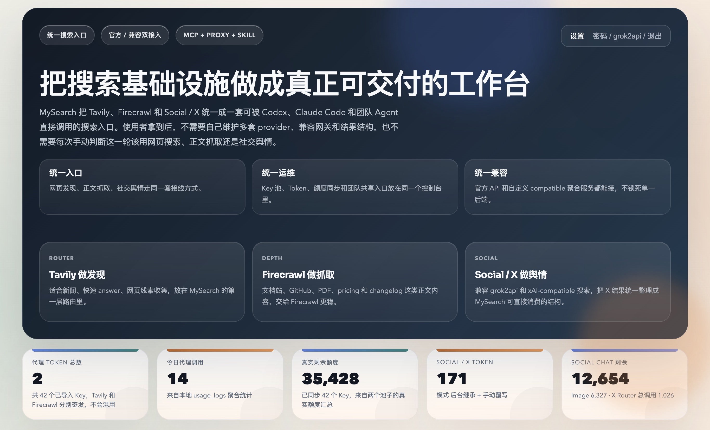

# Legacy Proxy Snapshot

这个 `proxy/` 目录现在是保留在 `tavily-key-generator` 里的历史兼容副本。

如果你要部署正式对外可用的统一搜索控制台、MCP、Skill 和 Social / X
路由，请直接使用独立仓库：

- [MySearch-Proxy](https://github.com/skernelx/MySearch-Proxy)

## 当前推荐的正式入口

`MySearch-Proxy` 负责：

- 统一控制台
- `Tavily + Firecrawl + Social / X` 聚合路由
- MCP Server
- 可直接安装给智能体使用的 Skill
- 官方接口与 compatible 网关双接入
- 面向 `Codex` / `Claude Code` 的最终接线方式

## 控制台预览

### 首屏



### 工作台


## 和 `tavily-key-generator` 的关系

当前仓库继续负责上游 provider 层：

- 注册 Tavily / Firecrawl key
- 做真实可用性验证
- 可选上传到统一代理池
- 作为 `MySearch-Proxy` 的 Tavily / Firecrawl key 来源

注册器上传时仍会带上 `service` 字段，例如：

```json
{
  "key": "fc-xxxx",
  "email": "fc-xxx@example.com",
  "service": "firecrawl"
}
```

所以：

- Tavily 上传会进入 Tavily 池
- Firecrawl 上传会进入 Firecrawl 池
- 服务端不需要再靠 key 前缀猜测服务

## 新部署建议

推荐直接部署 `MySearch-Proxy`：

```bash
docker pull skernelx/mysearch-proxy:latest
```

项目地址：

- [skernelx/MySearch-Proxy](https://github.com/skernelx/MySearch-Proxy)

## 旧部署如何迁移

如果你已经在跑这个目录下的旧 `proxy/`，更稳的迁移方式是：

1. 保留原来的数据卷目录
2. 改用 `skernelx/mysearch-proxy:latest`
3. 继续挂载到 `/app/data`
4. 使用新的 `proxy/.env` 或容器环境变量补齐配置

一个通用迁移示例：

```bash
docker pull skernelx/mysearch-proxy:latest

docker rm -f mysearch-proxy 2>/dev/null || true

docker run -d \
  --name mysearch-proxy \
  --restart unless-stopped \
  -p 9874:9874 \
  -e ADMIN_PASSWORD=your-admin-password \
  -v /your/data/path:/app/data \
  skernelx/mysearch-proxy:latest
```

只要保留原数据卷，已有 Key、Token 和控制台里的数据就可以继续沿用。

## 兼容 API 摘要

当前这套能力对外仍然兼容这些重点接口：

- Tavily
  - `POST /api/search`
  - `POST /api/extract`
- Firecrawl
  - `/firecrawl/*`
  - 示例：`POST /firecrawl/v2/scrape`
- Social / X
  - `POST /social/search`
  - `GET /social/health`

认证方式支持：

- `Authorization: Bearer YOUR_TOKEN`
- body 里传 `api_key`

## 如果你只是要保留本地旧目录

这个目录还可以继续作为历史兼容副本使用：

```bash
cd proxy
docker compose up -d
```

但它不再是对外发布时的主推荐入口。
